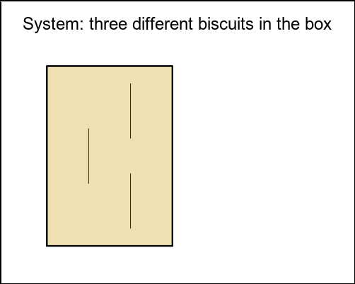
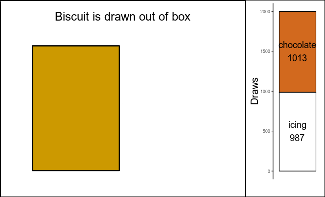
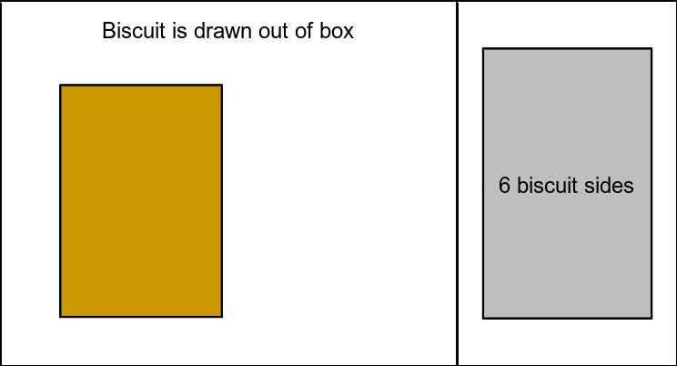

```{r,include=FALSE}
knitr::opts_chunk$set(message=FALSE,warning=FALSE)

# Load the function for creating a specific animated graphic
source("scripts/draw_biscuit_function.R")

# And initialize values for it
box.edges.x <- c(-2.4,-0.1)
box.edges.y <- c(-1.9,1.4)
box.width <- box.edges.x[2] - box.edges.x[1]
box.height <- box.edges.y[2] - box.edges.y[1]
biscuit.radius <- 0.5
```

I stumbled upon a probability exercise at a time when I had just built enough confidence using R, and I was eager for "toy problems" to play with. It was a simple brain teaser, barely more complicated than the well-known <a href="https://en.wikipedia.org/wiki/Coin_flipping" target="_blank">coin toss</a>. I could solve it with pen and paper, but I wanted to squeeze out of it as much as I could.

My central thesis in this post is that, if we formulate our assumptions well, we can turn questions about **probability** into questions about **data**.

## The problem

> You have three biscuits in a box. Each biscuit has two sides, and each side is covered in either white icing or chocolate. One biscuit has two chocolate sides. The second biscuit has one chocolate and one white icing side. The third biscuit has two white icing sides.
>
> You reach into the box, draw out a biscuit and place it flat on the table. A chocolate side is shown facing up, but you do not know the color of the side facing down. Prove that the probability that the other side is also chocolate is $\frac{2}{3}$.

Let's take it apart. The problem asks a question based on certain assumptions. These assumptions are what I'm going to call a **system** and a **process**.

```{r,eval=!dir.exists("images"),include=FALSE}
# If an "images" folder doesn't exist, create it.
dir.create("images")
```

#### The system

There are 3 biscuits in the box:

1.  Both sides covered in chocolate

2.  One side covered in chocolate and one covered in icing

3.  Both sides covered in icing

#### The process

One random biscuit is drawn out. We see that its up-facing side is covered in chocolate, but we don't see its down-facing side.

#### The task

Show that the probability of its down-facing side being also covered in chocolate is $\frac{2}{3}$ (or 0.666...).

```{r,eval=!file.exists("images/intro_illustration.gif"),file="scripts/intro_illustration.R",include=FALSE}
# Creation of the "intro_illustration.gif" animation.
```

```{r,echo=FALSE,out.width="75%",fig.cap="Biscuit-drawing problem"}

```

## How *not* to solve it

If we feel **really** confident, we can go along this line of thought:

-   The up-facing side of our drawn biscuit is covered in chocolate, so there are two possibilities:

    1.  Either it is the one whose both sides are covered in chocolate $\implies$ its down-facing side also has chocolate,

    2.  or it is the mixed one $\implies$ its down-facing side has icing.

-   This means that the probability of the down-facing side being chocolate is 50%, or $\frac{1}{2}$.

And we already know we're wrong, because our result is not $\frac{2}{3}$.

So... what went wrong? Well, it all started when we felt **really** confident and "solved" it in a matter of seconds. Because of this, we didn't formulate the assumptions correctly.

The correct pen-and-paper way to solve it is [shown](#analytical-solution) at the end of this post, but for now, let's see how we can make the computer solve it for us.

## Solution

The task concerns *probability*, which is about predicting future outcomes. Now, computers are not very good fortune-tellers but they are good at processing data.

To take advantage of this, we can turn the task into a statistical one:

> "Of the times a chocolate side was placed facing up, show that the *frequency* of its down-facing side being also chocolate is $\frac{2}{3}$."

### Simulate and collect data

First, we **define the system**: 3 biscuits and the box containing them.

```{r,eval=!file.exists("biscuit_draws.csv"),file="scripts/define_biscuits.R"}

```

Next, we **simulate the process** of biscuit drawing repeatedly, and collect the data. Any large number of repetitions will do. The code below performs this 2000 times and collects the results in a `data.table` named `biscuit.draws` for further analysis.

I use the <a href="https://rdatatable.gitlab.io/data.table/" target="_blank">`data.table`</a> package for filtering and summarizing data (to experienced R users: no disrespect to the Tidyverse, I just avoid it as much as I can).

```{r,eval=!file.exists("biscuit_draws.csv"),file="scripts/drawing_simulation.R"}

```

```{r,eval=!file.exists("biscuit_draws.csv"),include=FALSE}
# The resulting data.table is written to a .csv file
fwrite(biscuit.draws,"biscuit_draws.csv")
```

### Results

Let's take a quick peek at our data:

```{r,include=FALSE}
library(data.table)
total.draws <- 2000
biscuit.draws <- fread("biscuit_draws.csv")
```

```{r}
biscuit.draws
```

Indeed, there are 2000 rows and each row shows the results of one drawing process. Let's count how many times each different type of side was placed facing up:

```{r}
# Count occurrences of each different type of up.side
# ".N" is a special symbol in data.table, which gives the number of rows
biscuit.draws[,.(count=.N),by=up.side]
```

Chocolate and icing were drawn as up-facing sides about half of the times each (1013 and 987, out of 2000 total draws). Now let's count how many times each **combination** of sides was drawn:

```{r}
# Count occurrences of up.side and down.side combinations
biscuit.draws[,.(count=.N),by=.(up.side,down.side)]
```

So, from the 1013 times the up-facing side was chocolate, the down-facing side was also chocolate 667 times - **suspiciously** close to $\frac{2}{3}$ of 1013.

```{r,out.width="100%",fig.cap="Number of occurrences for each type of side, after 2000 biscuit draws.",echo=FALSE,eval=FALSE}
# This code chunk is not shown or run in the blog post, as it would be redundant with the animation below.
# Switch eval to TRUE to run it and create a simple bar plot.

library(ggplot2)

biscuit.draws[,.(count=.N),by=.(up.side,down.side)] |>
  ggplot(mapping=aes(x=up.side,fill=down.side,y=count)) +
  labs(x="Up-facing side",fill="Down-facing side",y="Draws") +
  scale_fill_manual(values=c("chocolate","white")) +
  geom_col(colour="black")
```

```{r,eval=!file.exists("images/simulation_result.gif"),file="scripts/simulation_result.R",include=FALSE}
# Creation of "simulation_result.gif" animation.
```

```{r,echo=FALSE,out.width="100%",fig.cap="Left: illustration of random biscuit drawing; right: results after 2000 biscuit draws. Green frame on right side: considered cases."}

```

Let's calculate the exact frequency:

```{r}
# Of the draws that resulted in chocolate up-side,
# count the ones that also had chocolate down-side
# and divide them by the total draws with chocolate up-side.
biscuit.draws[up.side=="chocolate",
              sum(down.side=="chocolate")/.N]
```

This number is incredibly close to the desired $\frac{2}{3}$, or 0.666.

#### Significance testing

We could stop here, declare victory, and it would be fine. In the interest of thoroughness, we can perform a *chi-squared* goodness-of-fit test to formally check if the observations deviate significantly from our expectations.

As in any significance test, there is a *null hypothesis* that the observations comply with our expected frequencies. If the resulting p-value is *less than 0.05*, then we can conclude that the observed frequencies deviate significantly from our expectation. Otherwise, we cannot reject the null hypothesis.

**Note:** The p-value threshold needs to be specified before performing the test and is arbitrary. The 0.05 threshold we chose is solely based on common practice. We could make it more stringent (e.g. 0.01) or more relaxed (e.g. 0.1). The p-value answers the (admittedly complicated) question: "What is the probability of these observations to come up if the null hypothesis is true?". More information on p-values <a href="https://www.statisticshowto.com/probability-and-statistics/statistics-definitions/p-value/" target="_blank">here</a>.

```{r}
# How many draws resulted in both sides chocolate
both.sides.chocolate <- biscuit.draws[up.side=="chocolate" & down.side=="chocolate", .N]

# How many draws resulted in only up-facing side chocolate
upside.only.chocolate <- biscuit.draws[up.side=="chocolate" & down.side=="icing", .N]

# Chi-squared test for goodness of fit
# x is the numbers of observed events
# p is the expected probabilities corresponding to the events
chisq.test(x=c(both.sides.chocolate,upside.only.chocolate),
           p=c(2/3,1/3))
```

The resulting p-value is **way** higher than 0.05, which formalizes a bit more our initial conclusion: the probability in question is indeed $\frac{2}{3}$.

#### Progression of frequency

So far, we've examined the end-point results **after** 2000 biscuit draws: the resulting frequency is about $\frac{2}{3}$, which is perfectly sufficient for our question.

The benefit of data-driven analysis is, we can look at the data in any way we want. Consider the following question:

> During the 2000 biscuit draws, how did the frequency progress until reaching $\frac{2}{3}$?

Let's see what the data says, on the following video:

```{r,eval=!file.exists("images/frequency_tracking_plot.mp4"),file="scripts/frequency_tracking_plot.R",include=FALSE}
# Creation of "frequency_tracking_plot.mp4" video animation.
```

<video width="664" height="402" controls>

<source src="images/frequency_tracking_plot.mp4" type="video/mp4">

</video>

Video 1: Progression of frequency throughout simulations. Red dashed line at $\frac{2}{3}$.

During the first few draws the frequency fluctuates, then it sits a bit higher than $\frac{2}{3}$, before settling at $\frac{2}{3}$ after around 300 simulated draws. This makes sense: each biscuit draw is random individually, so the first few draws show no pattern. But the more data we gather, the more the frequency **approaches** the true probability.

### Analytical solution

The "traditional" way to approach this problem is to lay down and count all possible outcomes to find the **true** probabilities. This is also called the *counting* method.

There are 3 biscuits, i.e. 6 up-facing sides available to draw from:

-   3 chocolate sides:

    1.  One side of biscuit with both sides covered in chocolate $\implies$ down-facing side: chocolate

    2.  Other side of biscuit with both sides covered in chocolate $\implies$ down-facing side: chocolate

    3.  Chocolate side of mixed biscuit $\implies$ down-facing side: icing

-   3 icing sides (we don't care about these cases):

    1.  One side of biscuit with both sides covered in icing $\implies$ down-facing side: icing

    2.  Other side of biscuit with both sides covered in icing $\implies$ down-facing side: icing

    3.  Icing side of mixed biscuit $\implies$ down-facing side: chocolate

Let's depict these outcomes in the *sample space*, which includes all possible outcomes of the biscuit drawing process:

```{r,eval=!file.exists("images/probability_result.gif"),file="scripts/probability_result.R",include=FALSE}
# Creation of "probability_result.gif" animation.
```

```{r,echo=FALSE,out.width="100%",fig.cap="Left: illustration of random biscuit drawing; right: sample space including all possible outcomes of the process. Green frame on right side: considered outcomes."}

```

It's obvious from the outcome listing and from figure 3 that the real probability of a down-facing chocolate side after a chocolate-covered up-facing side actually is $\frac{2}{3}$.

## What's the point

The biscuit-drawing problem gives a random process, and asks a question about probability. The [analytical method](#analytical-solution) is to count all possible outcomes to derive the *true probabilities*. On the other hand, our [simulation method](#solution) was to repeat the process 2000 times and look at *frequencies* of events as a read-out of their probabilities.

The two methods arrive to the same conclusion from different angles. The **analytical method** is *deductive*. It relies on intuition to consider all outcomes of the random process and gives definitive answers. It's a *top-down* approach to the answer. On the contrary, our **simulation method** is *inductive*. It is agnostic to the possible outcomes of the random process and only requires its accurate formulation, with the result emerging as a pattern from performing it. It's a *bottom-up* approach.

|  | Analytical method | Simulation method |
| - | ------------------ | ------------------ |
Reasoning: | Deductive | Inductive |
Requires: | Understanding of process and outcomes | Understanding of process, multiple iterations |
Provides: | True probabilities | Close approximations |

By now, it's fair to wonder: what's the point? Why go through the trouble to simulate hundreds or thousands of iterations and analyze data (and learn coding to do all that), when you can just use the counting method? It requires extra effort and, after all, simulations only give *approximate* probabilities.

Simulation approaches are not meant to substitute analytical ones but to complement them, adding value in (at least) the following ways:

-   As they don't rely on intuition, they can point towards the right conclusions, even if they are counter-intuitive (as in the <a href="https://en.wikipedia.org/wiki/Monty_Hall_problem" target ="_blank">Monty Hall problem</a>).

-   They can provide leads for analytical research.

-   Educational value:
    
    -   They enable a more *interactive* pedagogical approach: recreating a process and analyzing tangible data allows the learner to reach the conclusions on their own.
    
    -   They help the learner bridge the mental gap between probability theory and statistics.

(*Full source code for post on <a href="https://github.com/dimitriskokoretsis/blog_public/tree/main/random-biscuits" target="_blank">GitHub</a>*)